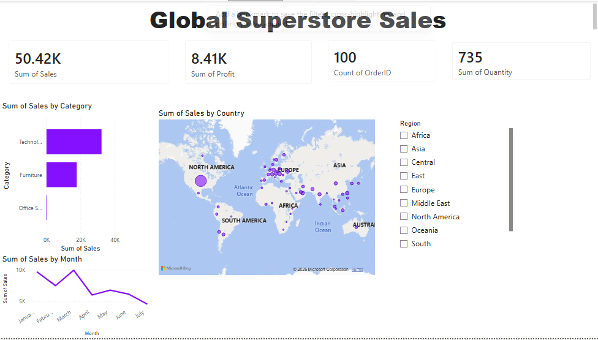

# Global Superstore Sales Dashboard

## Project Overview
Sales analysis of Global Superstore dataset built using Power BI Desktop.

## Key Insights
- Technology category has highest sales
- North America is top performing region
- Sales trend analysis by month
- Profit and quantity KPI tracking

## Tools Used
- Power BI Desktop
- CSV Dataset

## Dashboard Preview

## Dataset
Global Superstore dataset containing sales,profit,shipping data across
Global Superstore dataset containing orders,
sales, profit, shipping data acros8is regions.
